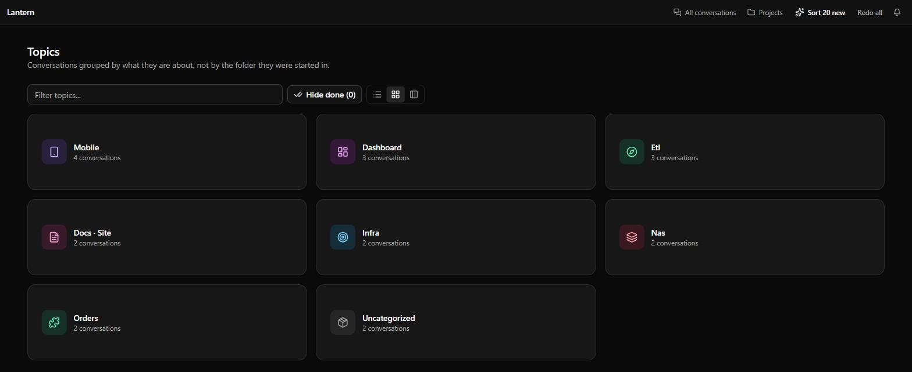
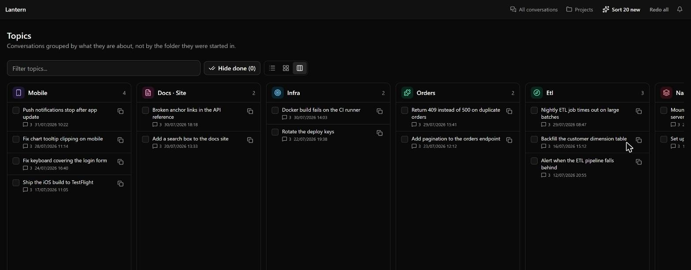
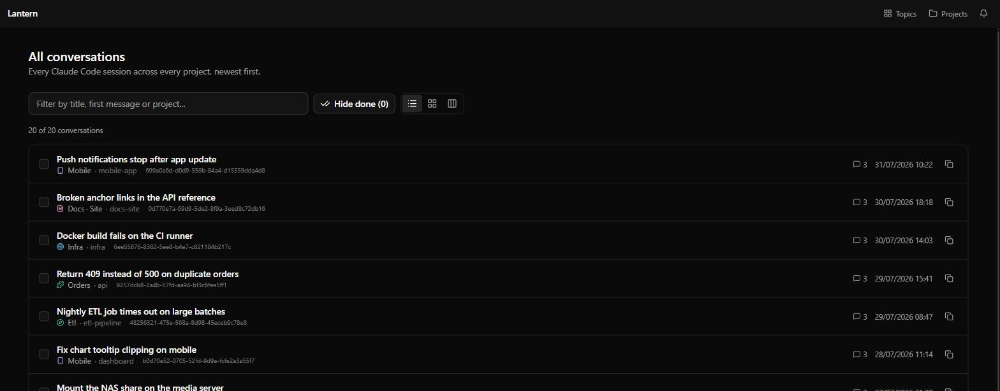

# Lantern

[](https://github.com/WildChildForLife/lantern/actions/workflows/ci.yml)
[](https://github.com/WildChildForLife/lantern/actions/workflows/codeql.yml)
[](https://www.npmjs.com/package/lantern-viewer)
[](https://github.com/WildChildForLife/lantern/pkgs/container/lantern)
[](LICENSE)
[](https://nodejs.org)
[](CONTRIBUTING.md)

> Find the conversation you forgot you started.

Lantern is a self-hosted dashboard for your agent CLI sessions. It reads the logs Claude Code already
writes to `~/.claude/projects/` — and, optionally, Codex CLI's rollouts in `~/.codex/sessions/` and
opencode's storage in `~/.local/share/opencode/` — then groups every conversation by **what it is
about**, not by which folder it happened to start in.

If you run a lot of Claude Code sessions across a lot of projects and machines, the folder view stops
helping: one directory ends up holding thirty unrelated conversations. Lantern gives you topics, a
searchable list of everything, and a board view of the lot.

<p align="center">
  
</p>

## Contents

- [What it does](#what-it-does)
- [Install](#install) · [macOS](#macos) · [Linux](#linux) · [Windows](#windows) ·
  [npm](#npm-any-platform) · [Docker](#docker) · [From source](#from-source) ·
  [Platform support](#platform-support)
- [Usage](#usage) · [Options](#options) · [Security](#security)
- [Reading other agent CLIs](#reading-other-agent-clis)
- [Reading logs from more than one machine](#reading-logs-from-more-than-one-machine)
- [How grouping works](#how-grouping-works)
- [Development](#development) · [Contributing](#contributing) · [Support](#support)
- [Privacy](#privacy) · [Licence](#licence)

## What it does

- **Topics instead of folders.** Conversations are clustered by subject, each topic with its own icon,
  colour and count. Grouping is local and deterministic by default: no model call, no network, no cost.
- **Optional AI naming.** One button hands the conversation titles to the Claude Code CLI you are
  already signed in to and gets back proper topic names like _Home Network_ or _Orders API_. Results
  are cached per session, nothing runs in the background, and each pass reports the usage it drew.
- **Every session in one place.** A flat, filterable list across every project — and every machine, if
  you point Lantern at more than one log directory.
- **More than one CLI.** Claude Code, Codex CLI and opencode sessions sit side by side, grouped into
  the same workspace when they ran in the same repo. Pick which CLIs to read in settings. Claude Code
  stays the interactive one; other sources are read-only.
- **Honest costs.** A CLI that records what a turn cost is believed; one that does not is estimated
  and marked `~`; a model with no price table reads `—` rather than `$0.00`.
- **Three layouts.** Rows, cards, or a full-width board with one column per topic, newest first.
- **Pick up where you left off.** Copy a conversation id to resume it from a terminal, or tick
  conversations off as done once you have dealt with them.
- **A full session viewer.** Live conversation log viewing, search, cost and token breakdowns, git
  integration, an in-app terminal, and PWA support for phones.

<p align="center">
  
</p>

## Install

Every package below pulls Node in as a dependency, so there is no runtime to install first. Claude
Code itself must be installed and signed in for the optional AI topic naming — everything else works
without it.

### macOS

```bash
brew install wildchildforlife/tap/lantern
lantern --port 3400
```

Sessions are read from `~/.claude/projects`. Everything works here, the in-app terminal included, on
both Intel and Apple Silicon.

### Linux

Debian and Ubuntu, from the `.deb` on the [latest release](https://github.com/WildChildForLife/lantern/releases/latest):

```bash
curl -fsSLO https://github.com/WildChildForLife/lantern/releases/latest/download/lantern_0.1.0_amd64.deb
sudo apt install ./lantern_0.1.0_amd64.deb    # swap amd64 for arm64 on a Pi
lantern --port 3400
```

Fedora, RHEL and openSUSE, from the `.rpm`:

```bash
sudo dnf install https://github.com/WildChildForLife/lantern/releases/latest/download/lantern-0.1.0-1.x86_64.rpm
lantern --port 3400
```

Arch, from the AUR:

```bash
paru -S lantern      # or: yay -S lantern
lantern --port 3400
```

Sessions are read from `~/.claude/projects`. On `x86_64` everything works. On `aarch64` the in-app
terminal is unavailable — see [Platform support](#platform-support).

If your distribution is not listed, or you would rather not add a package, use
[npm](#npm-any-platform) or [Docker](#docker).

### Windows

```powershell
winget install OpenJS.NodeJS
npx lantern-viewer --port 3400
```

There is no native Windows package yet, so this is the one platform that still needs Node installed
first — [Docker](#docker) avoids that.

Sessions are read from `%USERPROFILE%\.claude\projects`, and Lantern's own cache from
`%USERPROFILE%\.lantern`. The `claude` executable is found on `PATH` with `where`, so if
`where claude` finds nothing, pass `--executable` with the full path.

The in-app terminal is unavailable on Windows — see [Platform support](#platform-support). If you want
it, run Lantern inside **WSL2** instead and treat it as a Linux install; sessions written by a Windows
Claude Code are then reachable at `/mnt/c/Users/<you>/.claude`, which you can point at with
`--claude-dir`.

### npm (any platform)

Needs Node.js 24 or newer already present:

```bash
npx lantern-viewer --port 3400
```

### Docker

Identical on macOS, Linux and Windows apart from the volume syntax.

```bash
docker run -d --name lantern \
  -p 127.0.0.1:3400:3400 \
  -v "$HOME/.claude:/root/.claude:ro" \
  -v lantern_cache:/root/.lantern \
  ghcr.io/wildchildforlife/lantern:latest
```

On Windows PowerShell, swap `$HOME` for `$env:USERPROFILE` and the line continuations for backticks:

```powershell
docker run -d --name lantern `
  -p 127.0.0.1:3400:3400 `
  -v "${env:USERPROFILE}\.claude:/root/.claude:ro" `
  -v lantern_cache:/root/.lantern `
  ghcr.io/wildchildforlife/lantern:latest
```

Or with Compose, which is the same thing plus a password:

```bash
curl -O https://raw.githubusercontent.com/WildChildForLife/lantern/main/docker-compose.yml
echo "LANTERN_PASSWORD=pick-something" > .env
docker compose up -d
```

That mounts Claude Code's logs only. To read Codex or opencode as well, see
[Reading other agent CLIs](#reading-other-agent-clis).

Images are published for `linux/amd64` and `linux/arm64`, so a Raspberry Pi or an Apple Silicon
machine works the same way — except the in-app terminal, which is unavailable on the `arm64` image.

### From source

Any platform, once Node 24 and pnpm are present:

```bash
git clone https://github.com/WildChildForLife/lantern.git
cd lantern
pnpm install
pnpm build
node dist/main.js --port 3400
```

Then open <http://localhost:3400>.

### Platform support

Everything works everywhere except the in-app terminal, which needs a prebuilt PTY binary that
`@replit/ruspty` does not publish for every target. Where it is missing, Lantern disables the terminal
and says so in its startup log; nothing else is affected.

| Platform                       | Supported | In-app terminal |
| ------------------------------ | --------- | --------------- |
| macOS (Apple Silicon or Intel) | yes       | yes             |
| Linux `x86_64`                 | yes       | yes             |
| Linux `aarch64`                | yes       | no              |
| Windows                        | yes       | no — use WSL2   |

CI runs on Linux only, so macOS and Windows are verified by hand rather than on every commit. Reports
from either are welcome.

## Usage

```bash
node dist/main.js [options]
```

### Options

| Option                      | Environment                     | Description                                                 | Default     |
| --------------------------- | ------------------------------- | ----------------------------------------------------------- | ----------- |
| `-p, --port <port>`         | `PORT`                          | Port to listen on                                           | `3000`      |
| `-h, --hostname <hostname>` | `HOSTNAME`                      | Hostname to bind                                            | `localhost` |
| `-P, --password <password>` | `LANTERN_PASSWORD`              | Require a password. **Set this if you bind to `0.0.0.0`**   | (none)      |
| `--claude-dir <path>`       | `LANTERN_CLAUDE_DIR`            | Path to the Claude directory to read                        | `~/.claude` |
| `-e, --executable <path>`   | `LANTERN_CLAUDE_EXECUTABLE`     | Path to the `claude` executable                             | auto        |
| `--terminal-disabled`       | `LANTERN_TERMINAL_DISABLED`     | Turn off the in-app terminal                                | enabled     |
| `--terminal-shell <path>`   | `LANTERN_TERMINAL_SHELL`        | Shell used by terminal sessions                             | login shell |
| `--terminal-unrestricted`   | `LANTERN_TERMINAL_UNRESTRICTED` | Drop the restricted shell flags from bash terminal sessions | restricted  |
| `--api-only`                | `LANTERN_API_ONLY`              | Serve the API without the web UI                            | off         |
| `-v, --verbose`             | `LANTERN_VERBOSE`               | Verbose debug logging                                       | off         |
| `--source <id>`             | `LANTERN_SOURCES`               | Agent CLI to read; repeat for more. Scopes one run          | stored      |

Valid `--source` ids are `claude-code`, `codex` and `opencode`. Repeat the flag for more than one
(`--source claude-code --source codex`), or set `LANTERN_SOURCES` to a comma-separated list. Passing it
scopes a single run without changing what is stored in settings.

Flag-style environment variables are on for `1` or `true` and off otherwise.

### Security

> Lantern ships an in-app terminal. Binding to anything other than `localhost` without
> `--password` hands a remote shell to whoever finds the port. Use `--terminal-disabled` and a
> password, or keep it behind a VPN such as Tailscale. `--terminal-unrestricted` removes the guard
> rails from bash sessions, so treat it as widening that same hole.

The threat model, what a running instance exposes, and how to report a vulnerability privately are all
in [SECURITY.md](SECURITY.md). Please use
[GitHub Security Advisories](https://github.com/WildChildForLife/lantern/security/advisories/new)
rather than a public issue.

Lantern keeps its cache, push keys and schedules in `~/.lantern/` (`%USERPROFILE%\.lantern` on
Windows). Deleting that directory costs nothing but a rebuild on the next start.

## Reading other agent CLIs

Codex and opencode are read from wherever those CLIs themselves keep their history, so pointing Lantern
at them is the same gesture as pointing the CLI at them:

| Source        | Default location          | Moved by                              |
| ------------- | ------------------------- | ------------------------------------- |
| `claude-code` | `~/.claude`               | `--claude-dir` / `LANTERN_CLAUDE_DIR` |
| `codex`       | `~/.codex`                | `CODEX_HOME`                          |
| `opencode`    | `~/.local/share/opencode` | `XDG_DATA_HOME`                       |

`~` here is `$HOME`, or `%USERPROFILE%` on Windows shells that do not set `HOME`.

Enable the ones you want in settings, or scope a single run with `--source`.

In Docker each one needs its own mount, since only `~/.claude` is mounted by default:

```bash
docker run -d --name lantern \
  -p 127.0.0.1:3400:3400 \
  -v "$HOME/.claude:/root/.claude:ro" \
  -v "$HOME/.codex:/root/.codex:ro" \
  -v "$HOME/.local/share/opencode:/root/.local/share/opencode:ro" \
  -v lantern_cache:/root/.lantern \
  ghcr.io/wildchildforlife/lantern:latest
```

Read-only mounts are deliberate: Lantern only ever reads these directories.

## Reading logs from more than one machine

Lantern lists whatever lives under the Claude directory it reads. To pull in sessions from another
machine, symlink or mount that machine's project directories into `~/.claude/projects/`:

```bash
ln -s /mnt/c/Users/you/.claude/projects/my-project ~/.claude/projects/win-my-project
```

Directories on filesystems without inotify (a Windows drive mounted into WSL, for instance) are picked
up on restart rather than live.

<p align="center">
  
</p>

## How grouping works

**By default, locally.** Lantern takes the title Claude wrote for each conversation, drops the words
that say nothing (`fix`, `add`, `error`, `the`), and repeatedly carves off the largest group of
conversations sharing a word. Leftovers fall back to the folder they were started in, then to any topic
they mention, and anything still homeless lands in _Uncategorized_. It costs nothing and re-runs on
every request, so new conversations are grouped as they appear.

**Optionally, with Claude.** Keyword clustering names topics after words, which is sometimes clumsy.
Press **Sort N new** and Lantern batches the titles through `claude -p` and stores the answer per
session. It reuses your existing Claude Code login — there is no API key to configure and no separate
bill — and only classifies conversations it has not seen before. Nothing runs automatically.

## Development

```bash
pnpm install
pnpm gatecheck check   # format, lint, typecheck and tests over the diff
pnpm test
pnpm build
```

To work against the bundled fixtures instead of your own conversations:

```bash
node dist/main.js --port 4100 --claude-dir ./fixtures/claude-home
```

[AGENTS.md](AGENTS.md) describes the architecture: a Hono + Effect-TS backend, a Vite + TanStack Router
frontend, and a SQLite cache.

## Contributing

Bug reports, ideas and pull requests are all welcome. [CONTRIBUTING.md](CONTRIBUTING.md) covers the
setup, the quality gate to run before opening a pull request, and the house rules — no `as` casting,
Effect-TS for backend side effects, Hono RPC for API calls, and a preference for pure functions.

By taking part you agree to the [Code of Conduct](CODE_OF_CONDUCT.md).

## Support

- **Something broken, or an idea?** Open an [issue](https://github.com/WildChildForLife/lantern/issues).
- **A vulnerability?** Report it privately — see [Security](#security).
- **What changed?** See the [releases](https://github.com/WildChildForLife/lantern/releases).

## Privacy

Lantern reads your session logs locally and sends them nowhere. The only outbound traffic is the
optional topic classification, which goes through your own Claude Code CLI when you press the button.
See [PRIVACY.md](PRIVACY.md).

## Licence

[MIT](LICENSE) — © 2026 Lantern contributors.
